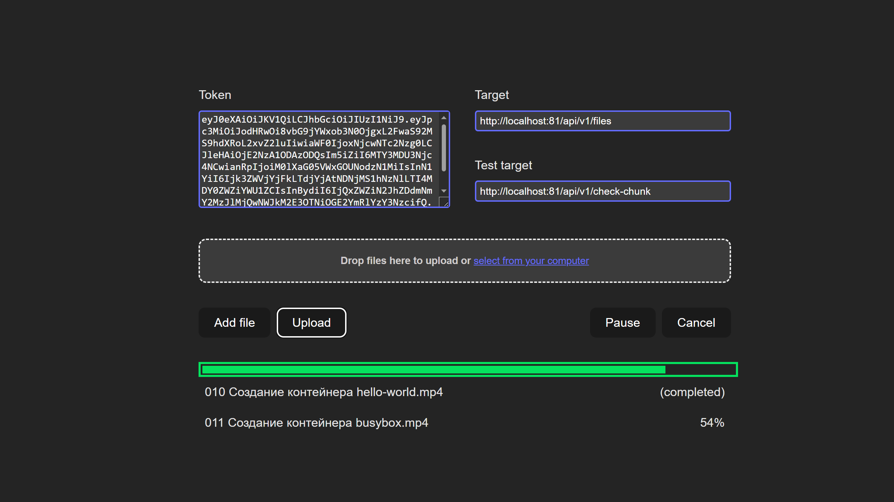

# Resumable

<p align="center">
  
</p>

Это реализация [Resumable.js](https://github.com/23/resumable.js) в виде библиотеки typescript

## Что такое Resumable.js

Resumable.js - это библиотека JavaScript, обеспечивающая несколько одновременных, стабильных и возобновляемых загрузок через HTML5 File API.

Библиотека предназначена для введения отказоустойчивости при загрузке больших файлов через HTTP. Это делается путем разделения каждого файла на небольшие чанки. Затем, всякий раз, когда загрузка блока завершается ошибкой, загрузка повторяется до завершения процедуры. Это позволяет файлам автоматически возобновлять загрузку после потери сетевого соединения либо локально, либо на сервере. Кроме того, это позволяет пользователям приостанавливать, возобновлять и даже восстанавливать загрузки без потери состояния, потому что будут прерваны только текущие загружаемые фрагменты, а не вся загрузка.

## Как я могу его использовать?

### Установка

```bash
pnpm install @teleskop150750/resumable
```

### Настройка

Создать новый `Resumable` объект с конфигурацией:

```js
const handleSendChunk = async (chunk: ResumableChunk) => {}
const handleTestChunk = async (chunk: ResumableChunk) => {}

const resumable = new Resumable({
  chunkSize: 1 * 1024 * 1024,
  simultaneousUploads: 1,
  handleSendChunk,
  handleTestChunk,
})
```

Чтобы разрешить выбор и перетаскивание файлов, необходимо добавить обработчики:

```js
const input = document.querySelector('.input')
const drop = document.querySelector('.drop')

input.addEventListener('change', (evt) => {
  resumable.handleInputChange(evt)
})

drop.addEventListener('drop', (evt) => {
  resumable.handleDrop(evt)
})
```

После этого взаимодействие с Resumable.js осуществляется путем прослушивания событий:

```js
resumable.on('fileAdded', (resumableFile) => {
  ...
});

resumable.on('fileSuccess', (resumableFile) => {
  ...
});

resumable.on('fileError', (resumableFile) => {
  ...
});
```

## Как настроить его на моем сервере?

Большая часть магии для Resumable.js происходит в браузере пользователя, но файлы все равно должны быть пересобраны из чанков на стороне сервера. Это должна быть довольно простая задача, которая и может быть достигнута с помощью любого веб-фреймворка или языка, способного обрабатывать загрузку файлов.

Для обработки состояния чанков загрузки вместе со всеми запросами отправляется ряд дополнительных параметров:

- `resumableChunkNumber`: Индекс блока в текущей загрузке. Первый это `1`.
- `resumableTotalChunks`: Общее количество чанков.
- `resumableChunkSize`: Общий размер блока. Используя это значение и `resumableTotalSize`, вы можете рассчитать общее количество блоков. Пожалуйста, обратите внимание, что размер данных, полученных по протоколу HTTP, может быть больше, чем `resumableChunkSize` для последнего фрагмента файла.
- `resumableTotalSize`: Общий размер файла.
- `resumableId`: Уникальный идентификатор файла, содержащегося в запросе.
- `resumableFileName`: Исходное имя файла
- `resumableRelativePath`: Относительный путь к файлу при выборе каталога (по умолчанию используется имя файла во всех браузерах, кроме Chrome).

Вы должны разрешить загрузку одного и того же фрагмента более одного раза; это не стандартное поведение, но в нестабильной сетевой среде это может произойти, и этот случай - именно то, для чего предназначен Resumable.js.

## Test

Включение `testChunks` позволит возобновить загрузку после перезагрузки браузера и даже в разных браузерах (теоретически вы можете даже запустить одну и ту же загрузку файлов через несколько вкладок или разных браузеров).

После того, как это сделано и `testChunks` включено, загрузка может быстро наверстать упущенное даже после перезагрузки браузера, просто проверив уже загруженные фрагменты, которые не нужно загружать снова.

## Полная документация

### Конфигурация

Объект загружается с конфигурацией:

```js
const resumable = new Resumable({opt1:'val', ...});
```

Доступны следующие параметры конфигурации:

```ts
interface ResumableConfig {
  /**
   * Обработчик загрузки чанка
   */
  handleSendChunk: (chunk: ResumableChunk) => void
  /**
   * Обработчик проверки существования чанка
   */
  handleTestChunk: (chunk: ResumableChunk) => void
  /**
   * Расставьте приоритеты для первого и последнего фрагментов всех файлов.
   * Это может быть удобно, если вы можете определить,
   * действителен ли файл для вашей службы только из первого или последнего фрагмента.
   * Например, метаданные фото или видео обычно находятся в первой части файла,
   * что упрощает тестирование поддержки только первого chunk.
   * (По умолчанию: false)
   */
  prioritizeFirstAndLastChunk: false
  /**
   * Размер каждого загруженного фрагмента данных в байтах.
   * Если `forceChunkSize = false`, последний загруженный чана будет
   * как минимум такого размера или не более чем в два раза больше.
   * (По умолчанию: 1*1024*1024 )
   */
  chunkSize: number
  /**
   * Минимальный допустимый размер файла.
   * (По умолчанию: undefined)
   */
  minFileSize: Nillable<number>
  /**
   * Максимально допустимый размер файла.
   * (По умолчанию: undefined)
   */
  maxFileSize: Nillable<number>
  /**
   * Заставьте все chunks быть меньше или равны размеру chunkSize.
   * В противном случае последний кусок будет больше или равен.
   * (По умолчанию: true)
   */
  forceChunkSize: boolean
  /**
   * Количество одновременных загрузок (по умолчанию: 3)
   */
  simultaneousUploads: number
  /**
   * Сделайте запрос GET к серверу для каждого chunk, чтобы узнать, существует ли он уже.
   * Если это реализовано на стороне сервера, это позволит загружать резюме даже после сбоя браузера или
   * даже перезагрузки компьютера. (По умолчанию: true)
   */
  testChunks: boolean
  /**
   * Указывает, сколько файлов может быть загружено за один сеанс.
   * Допустимыми значениями являются любое положительное целое число и, следовательно, без ограничений.
   * (По умолчанию: undefined)
   */
  maxFiles: Nillable<number>
  /**
   * Имя индекса блока (base-1) в текущем параметре POST загрузки, который будет использоваться для блока файла
   * (по умолчанию: resumableChunkNumber)
   */
  chunkNumberParameterName: string
  /**
   * Имя параметра POST общего числа блоков, используемых для блока файла
   * (по умолчанию: resumableTotalChunks)
   */
  totalChunksParameterName: string
  /**
   * Имя параметра POST общего размера блока, используемого для блока файлов
   * (по умолчанию: resumableChunkSize)
   */
  chunkSizeParameterName: string
  /**
   * Имя параметра POST общего размера файла, используемого для блока файла
   * (по умолчанию: resumableTotalSize)
   */
  totalSizeParameterName: string
  /**
   * Имя параметра POST уникального идентификатора, используемого для фрагмента файла
   * (по умолчанию: resumableId)
   */
  identifierParameterName: string
  /**
   * Имя исходного параметра POST с именем файла, используемого для фрагмента файла
   * (по умолчанию: resumableFileName)
   */
  fileNameParameterName: string
  /**
   * Имя параметра POST относительного пути к файлу, используемого для фрагмента файла
   * (по умолчанию: resumableRelativePath)
   */
  relativePathParameterName: string
  /**
   * Имя параметра POST текущего размера блока, используемого для блока файла
   * (по умолчанию: resumableCurrentChunkSize)
   */
  currentChunkSizeParameterName: string
  /**
   * Имя параметра POST типа файла, используемого для фрагмента файла
   * (по умолчанию: resumableType)
   */
  typeParameterName: string
  /**
   * Дополнительный префикс добавляется перед именем каждого параметра
   * (по умолчанию: '')
   */
  parameterPrefix: string
  /**
   * Задержка перед обновлением прогресса
   * (по умолчанию: 1)
   */
  throttleProgressCallbacks: number
  /**
   * Максимальное количество попыток для чанка до того, как загрузка не удастся.
   * Допустимыми значениями являются любые положительные целые числа и undefined без ограничений.
   * (по умолчанию: 2)
   */
  maxChunkRetries: number
  /**
   * Количество миллисекунд ожидания перед повторной попыткой выполнения фрагмента в случае непостоянной ошибки.
   * Допустимыми значениями являются любые положительные целые числа и undefined немедленная повторная попытка.
   * (по умолчанию: undefined)
   */
  chunkRetryInterval: Nillable<number>
  /**
   * Очищать input при добавлении
   * (по умолчанию: true)
   */
  clearInput: boolean
  /**
   * Задайте тип содержимого блока из исходного файла file.type.
   * (По умолчанию: false)
   */
  setChunkTypeFromFile: boolean
  /**
   * Типы файлов, разрешенные для загрузки. Пустой массив допускает любой тип файла.
   * (По умолчанию: [])
   */
  fileTypes: Array<string>
  generateUniqId: (fileWithPath: FileWithPath, event: Event) => string | Promise<string>
  maxFilesErrorCallback: (files: FileWithPath[], maxFiles: number) => void
  minFileSizeErrorCallback: (file: File, minFileSize: number) => void
  maxFileSizeErrorCallback: (file: File, maxFileSize: number) => void
  fileTypeErrorCallback: (file: File, fileTypes: Array<string>) => void
}
```

## Метода

```ts
r.handleInputChange(event) // Обработать событие `change`
r.handleDrop(event) // Обработать событие `drop`
r.on(event, callback) // Прослушать событие из Resumable.js (см. ниже)
r.upload() // Начните или возобновите загрузку
r.pause() // Приостановка загрузки
r.cancel() // Отмените загрузку всех объектов и удалите их из списка
r.getProgress() // Возвращает плавающую точку от 0 до 1, указывающую текущий ход отправки всех файлов
r.isUploading() // Возвращает логическое значение, указывающее, загружает ли экземпляр в данный момент что-либо.
r.addFile(file: File) // Добавьте объект HTML5 File в список файлов.
r.addFiles(files: FileList | File[]) // Добавьте массив объектов HTML5 File в список файлов.
r.removeFile(file: ResumableFile) // Отмена отправки определенного объекта и удалить из списка.
r.getResumableFileByUid(uniqueId) // Поиск объекта по его уникальному идентификатору.
r.getSize(uniqueId) // Возвращает общий размер отправляемой передачи в байтах.
```

### События

```ts
interface ResumableEvents {
  /**
   * Добавлен новый файл
   */
  fileAdded: (file: ResumableFile, event: Event) => void
  /**
   * Были добавлены новые файлы (и, возможно, некоторые из них были пропущены).
   */
  filesAdded: (newFiles: ResumableFile[], skippedFiles: FileWithPath[]) => void
  /**
   * Был завершен определенный файл
   * response - ответ сервера
   */
  fileSuccess: (file: ResumableFile, response: unknown) => void
  /**
   * Выполняется загрузка определенного файла
   * response - ответ сервера
   */
  fileProgress: (file: ResumableFile, response: unknown) => void
  /**
   * Что-то пошло не так во время загрузки определенного файла, загрузка повторяется
   */
  fileRetry: (file: ResumableFile) => void
  /**
   * Произошла ошибка при загрузке определенного файла
   * response - ответ сервера
   */
  fileError: (file: ResumableFile, response: unknown) => void

  /**
   * Загрузка запущена для объекта Resumable
   */
  uploadStart: () => void
  /**
   * Загрузка завершена
   */
  complete: () => void
  /**
   * Прогресс загрузки
   */
  progress: (message: string) => void
  /**
   * Загрузка приостановлена
   */
  pause: () => void

  /**
   * Событие перед добавлением файлов
   */
  beforeAdd: () => void
  /**
   * Триггеры перед отменой загрузки.
   */
  beforeCancel: () => void
  /**
   * Загрузка отменена
   */
  cancel: () => void
  /**
   * Произошла ошибка, в том числе fileError
   */
  error: (file: File, message: string) => void

  /**
   * Начата подготовка файла к загрузке
   */
  chunkingStart: (file: ResumableFile) => void
  /**
   * Отображение хода подготовки файлов
   */
  chunkingProgress: (file: ResumableFile, doneOffset: number) => void
  /**
   * Файл готов к загрузке
   */
  chunkingComplete: (file: ResumableFile) => void
}
```

## ResumableFile

### Методы

```ts
f.getResumable(): Resumable // Обратная ссылка на родительский объект
f.getUniqueId(): string // Id
f.getFile(): File // File
f.getName(): string // Имя файла
f.getPath(): string // Относительный путь к файлу (по умолчанию используется имя файла, если относительный путь не существует)
f.getChunks(): ResumableChunk[] // Массив чанков

f.getProgress(): number // Возвращает плавающую точку от 0 до 1, указывающую текущий ход отправки файла.
f.abort() // Прервать загрузку файла.
f.cancel() // Прервать загрузку файла и удалить его из списка файлов для загрузки.
f.retry() // Повторите попытку загрузки файла.
f.bootstrap() // Перестройте состояние объекта, включая переназначение чанков.
f.isUploading(): boolean // Возвращает логическое значение, указывающее, загружаются ли блоки файлов.
f.isComplete(): boolean // Возвращает логическое значение, указывающее, завершил ли файл отправку и получил ли он ответ сервера.
```
